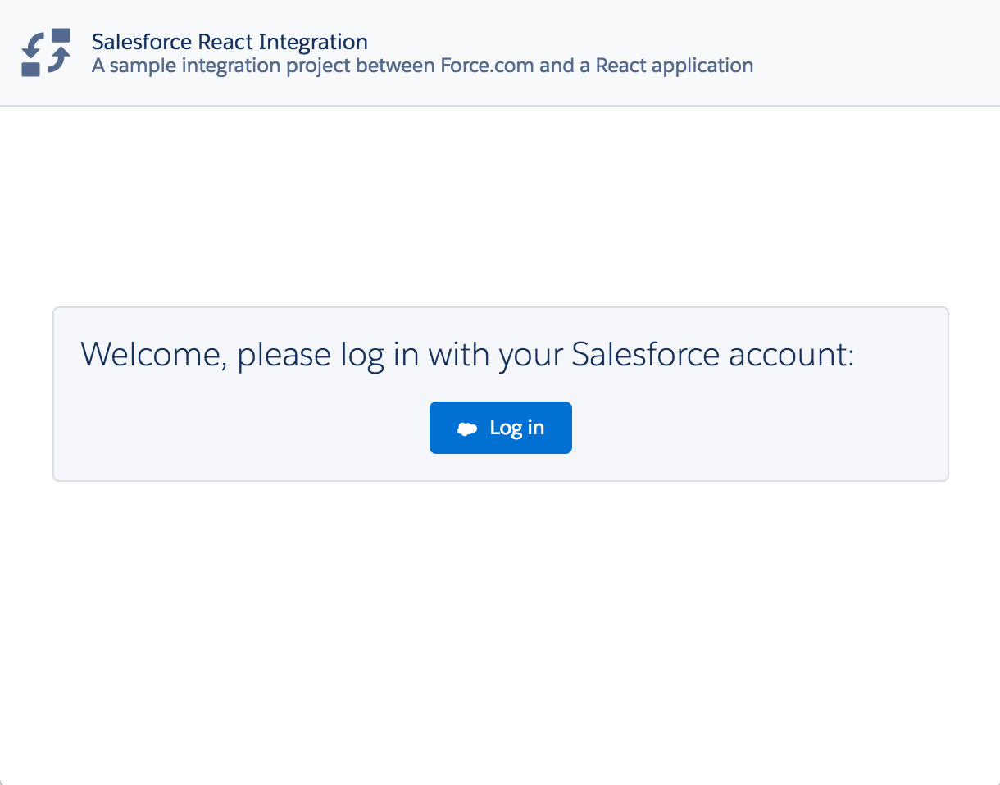
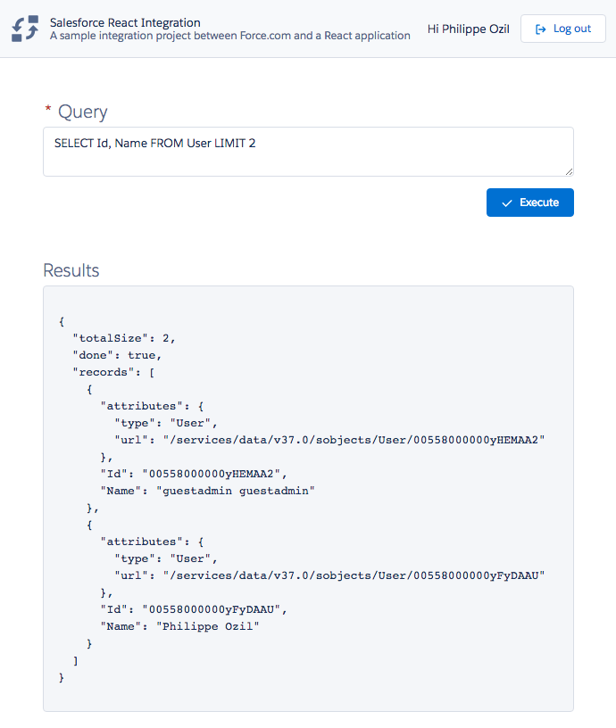

# Salesforce React.js integration

## About
Sample integration project between Salesforce and a React.js application.

This application demonstrates the following concepts:
- using [JSforce](https://jsforce.github.io) as a Salesforce client
	- authenticating with OAuth 2.0 (login, logout, retrieving session info)
	- using the REST API to run a SOQL query
- using the [Salesforce Lightning Design System](https://www.lightningdesignsystem.com) (SLDS) in a web application (all the CSS is provided by SLDS)

## Installation

1. Create a [Connected App](https://help.salesforce.com/articleView?id=connected_app_create.htm) in Salesforce.

1. Create a `.env` file in the root directory with this content (make sure to replace the values):
	```
	domain='https://login.salesforce.com'
	callbackUrl='http://localhost:8080/auth/callback'
	consumerKey='YOUR_CLIENT_KEY'
	consumerSecret='YOUR_CLIENT_SECRET'
	apiVersion='48.0'

	isHttps='false'
	sessionSecretKey='A_SECRET_STRING'
	```

1. Run `npm run build` to build the app.

1. Run `npm start` to start the app.

## Screenshots
<div style="text-align:center;">
	
	
</div>
